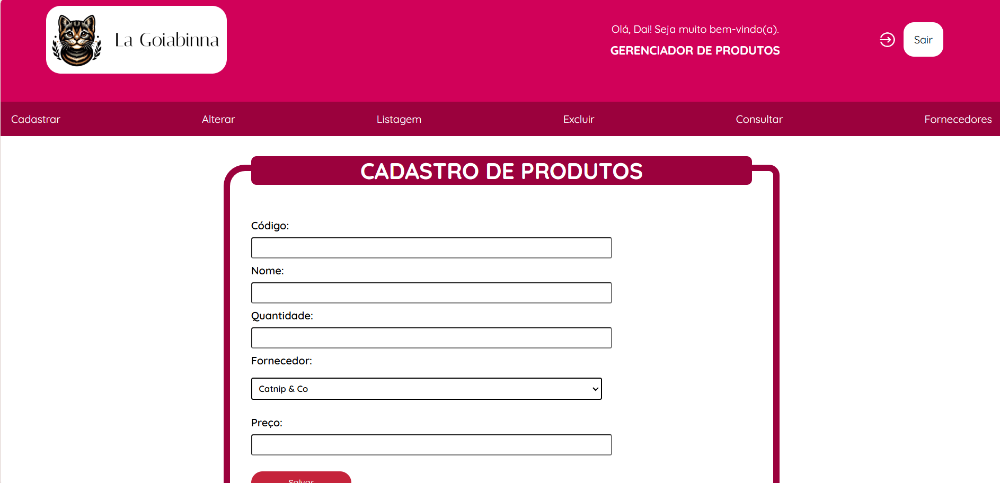

# LA GOIABINNA - Software para Controle de Produtos

## Informações

Design e código construídos em dupla pelas alunas <strong>Daiane Vitória Raso e Nicoli Caetano da Silva</strong>, com caráter educacional para aplicar habilidades de programação web, banco de dados e algoritmos de programação da disciplina Projeto Integrador II, orientado pelo docente Evandro Teruel do curso de graduação em Análise e Desenvolvimento de Sistemas - CAS (2º Semestre, 2024). Foram utilizados: HTML, CSS, JavaScript, JAVA, MySQL e Figma.

## Funcionalidades

- Validação em JavaScript de formulários;
- Pop-ups;
- Utilização de Banco de Dados;
- CRUD (cadastrar, alterar, excluir e consultar).

